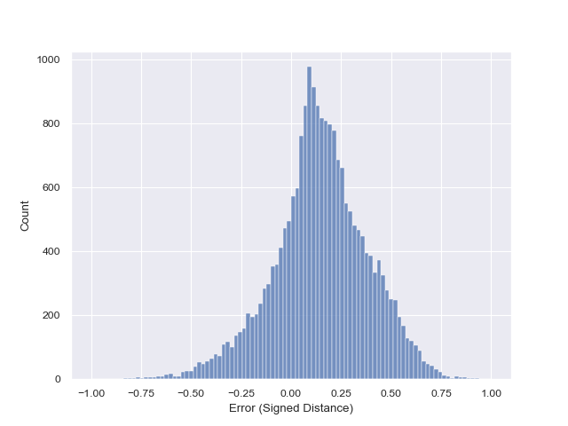
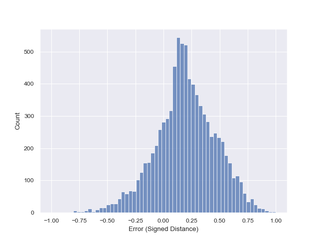

# **CNS-Assessment**
Repository for the CNS hra-amap assessment for the Python developer position.

To view the 3D outputs in the notebooks access the notebooks from here :

1. [<ins>Usage.ipynb</ins>](https://daj8112.github.io/CNS-Assessment/)

2. [<ins>Bidirectional Projections</ins>](https://daj8112.github.io/CNS-Assessment/BidirectionalProjections.html)

3. [<ins>Registration Error Visualization.ipynb</ins>](https://daj8112.github.io/CNS-Assessment/RegistrationErrorVisualization.html)


 ---
 Table of Contents:
 1. [My Process Documented](#my-process-documented)
 2. [Problems Occured](#problems-occured)
 3. [Optimizations](#optimizations)
 4. [Final Thoughts](#final-thoughts)

 ---
##  **My Process Documented**


SETUP

1. Downloaded the GLB model files for Male Left Kidney and Male Right Kidney. [(<ins>from here</ins>)](https://humanatlas.io/3d-reference-library?version=2.2&organ=All%20Organs)

2. Created a conda virtual environment for the assignment to manage the dependencies.
    (Python version: 3.12)

3. Glanced through the hra-amap Github repository.

4. Cloned the repo along with the [<ins>bcpd</ins>](https://github.com/ohirose/bcpd) repo inside the hra-amap directory, as i am using MacOS, had to install the `libomp` package using `brew install libomp`. <br>
Got the `clang` error so had to change the path for `libomp.dylib` in the makefile of bcpd repository to  ` /opt/homebrew/Cellar/libomp/19.1.7/lib/libomp.dylib`.

TESTING

5. Ran the 3 notebooks and gained a basic idea about what these do:
    - Changed the paths according to my local machine. (that's when I felt the need for relative paths).
    - **1st Notebook** demonstrates the usage of Registration Pipeline to align two 3d Organ models, it uses Pancreas as an example here.
    - **2nd Notebook** demonstrates Bidirectional Projection with an example of Millitome Ovary to HRA Female Left Ovary and vice versa.
    - **3rd Notebook** focuses on visualization, and analysing Registration Errors between two 3D point clouds of Generic Ovary and Reference Ovary in hra.

6. As a part of the Assessment, I am using a Male Left Kidney and a Male Right Kidney's GLB model files and projecting them on each other.

7. Made necessary changes to the notebooks to run for Kidneys.

8. To Understand more about the bigger picture i went throught the paper published of HRA.

---
##  **Problems Occured**

These are a few problems which I've faced along with the solutions:

1. The Setup of bcpd repository - Since it's not shipped with the hra-amap repository, and I am using MacOS had some clang issues.

2. The File Paths - I've changed the file paths to relative which makes the code reusable.

3. For the Registration Error Visualization notebook this particular code cell: 

    ```
    sd = trimesh.proximity.signed_distance(hra_atlas, projections.registration.vertices)
    ```
    The Kernel died after running about for 10 mins.<br>
    I tried running a few times after restarting my kernel as well, but still got the same result.<br>

    Then I experimented with simplifying the 3D point cloud with quadric decimation with 50% and 80% reduction in vertices. 

    ```
    sampled = projections.registration.simplify_quadric_decimation(0.5)
    ```
    After this, the code worked as intented.

    These are the images for different values of threshold.


      <div style="display: flex; justify-content: space-between;">
        <div style="text-align: center;">
            
            <p>Histogram with 50% reduction</p>
        </div>
        <div style="text-align: center;">
            
            <p>Histogram with 80% reduction</p>
        </div>
     </div>
    We can clearly see that the count decreases in the 80% as the vertices have been reduced.
    Another observation is that the code takes significantly less time to run for 0.8 .

4. The modules in the src directory doesn't seem to have been documented, and they all have missing docstrings, which make them a bit too abstract when using.

5. Since the assessment clearly mentioned that the notebooks show the results of your code run, natively the notebooks don't show the 3D outputs in Github. - To show the 3D results in the cell outputs, I converted the notebooks into html files and deployed using GitHub Pages.

---
## **Optimizations**


1. Using proper coding methods and replacing the absolute file paths to relative, so that the code is more reusable.

2. Documenting the Python modules, which makes them a bit less abstract.

3. 

---
##  **Final Thoughts**

It was great working on this assessment, as this allows to showcase our credibility. While working on this assignment I went through CNS' HRA portal, even took a look at the research paper they had published and understood a lot about the work they do. Many improvements and further developments can be made but considering the crunch of time what can be done was limited.